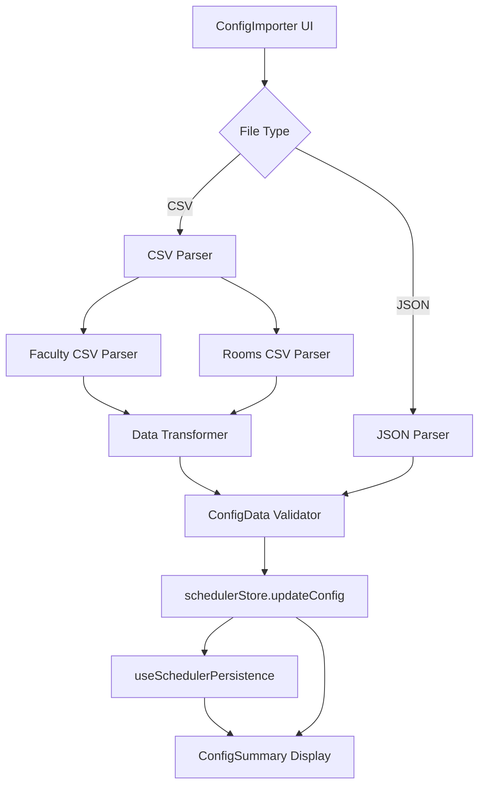

# Design Document: CSV Configuration Import

## Overview

This design extends the existing configuration import functionality to support CSV file formats in addition to JSON. The system will parse two CSV files (faculty.csv and rooms.csv) and transform them into the existing `ConfigData` structure used throughout the application. The implementation will integrate with the existing `ConfigImporter` component and leverage the current persistence and state management infrastructure.

## Architecture

### High-Level Flow

```
User selects CSV files → CSV Parser → Data Transformer → ConfigData → Existing Import Flow
```

The CSV import feature will be implemented as a parallel import path alongside the existing JSON import. Both paths converge at the `ConfigData` interface, ensuring compatibility with the rest of the application.

### Component Interaction



## Components and Interfaces

### 1. CSV Parser Module (`frontend/src/utils/csvParser.ts`)

A new utility module responsible for parsing CSV files and extracting structured data.

**Key Functions:**

```typescript
interface ParsedFacultyRow {
  name: string;
  initial: string;
}

interface ParsedRoomRow {
  slNo: string;
  course: string;
  capacity: number;
  registration: number;
  section: string;
  slotDay: string;
  slotTime: string;
  room: string;
}

function parseFacultyCSV(csvText: string): ParsedFacultyRow[]
function parseRoomsCSV(csvText: string): ParsedRoomRow[]
function parseCSV<T>(csvText: string, headerMap: Record<string, string>): T[]
```

The parser will:
- Handle CSV parsing with proper quote and comma handling
- Trim whitespace from all fields
- Skip empty rows and header rows
- Validate required fields are present

### 2. Data Transformer Module (`frontend/src/utils/csvTransformer.ts`)

Transforms parsed CSV data into the `ConfigData` structure.

**Key Functions:**

```typescript
function transformFacultyData(rows: ParsedFacultyRow[]): Faculty[]
function transformRoomsData(rows: ParsedRoomRow[]): {
  subjects: Subject[];
  timeslots: Timeslot[];
  buildings: Building[];
  rooms: Room[];
  sections: Section[];
}
function mergeConfigData(
  faculty: Faculty[],
  roomsData: ReturnType<typeof transformRoomsData>
): ConfigData
```

**Transformation Logic:**

#### Faculty Transformation
- Generate ID: `faculty-{sanitized-initial}` or `faculty-{sanitized-name}`
- Trim whitespace from names
- Set defaults: `maxSections: 3`, `maxOverload: 1`, `canOverload: true`

#### Rooms Data Transformation

**Subjects:**
- Extract unique course codes
- Generate ID: `subject-{sanitized-course-code}`
- Use course code as both name and code

**Timeslots:**
- Parse day and time (convert 12-hour to 24-hour format)
- Generate ID: `slot-{day-abbrev}-{start-time}`
- Calculate end time (assume 1.5 hour duration)
- Create label: `{Day} {start}–{end}`

**Buildings:**
- Extract building prefix from room code (e.g., "DS" from "DS0605")
- Generate ID: `building-{prefix}`
- Create label from prefix

**Rooms:**
- Generate ID: `room-{room-code}`
- Extract capacity from section capacity field
- Link to building via buildingId
- Create label: `{Building} {Room}`

**Sections:**
- Generate ID: `section-{course}-{section}`
- Link to subject, timeslot, and room via IDs
- Use capacity and registration from CSV

### 3. Enhanced ConfigImporter Component

Modify `frontend/src/components/config/ConfigImporter.tsx` to support CSV file selection.

**Changes:**
- Update file input to accept both JSON and CSV: `accept="application/json,text/csv"`
- Add file type detection based on extension
- Route to appropriate parser based on file type
- For CSV, prompt user to select both faculty.csv and rooms.csv (or handle single file with both)
- Validate that both CSV files are provided before processing

**UI Flow:**
1. User clicks "Import CSV" button
2. File picker allows selecting multiple CSV files
3. System validates that both faculty.csv and rooms.csv are present
4. Parse and transform data
5. Update config and persist using existing flow
6. Display configuration summary after successful import

### 4. Configuration Summary Display Component

Create a new component to display imported configuration data summary.

**Component:** `frontend/src/components/config/ConfigSummary.tsx`

**Purpose:** Display a summary of the imported configuration data to provide immediate feedback to users about what was loaded.

**Display Information:**
- Total count of faculty members
- Total count of subjects
- Total count of sections
- Total count of timeslots
- Total count of rooms
- Total count of buildings

**UI Design:**
- Show as a card or panel below the import buttons
- Use a grid layout to display counts in an organized manner
- Include icons or visual indicators for each entity type
- Highlight the summary with subtle animation when data changes
- Include a timestamp of when the data was last imported

**Integration:**
- Component receives `ConfigData` from the scheduler store
- Automatically updates when configuration changes
- Shows "No configuration loaded" state when config is empty

### 5. Time Conversion Utility

Add time parsing utility to handle 12-hour to 24-hour conversion.

```typescript
function parseTime12to24(time12: string): string {
  // "2:40 PM" → "14:40"
  // "8:00 AM" → "08:00"
}

function calculateEndTime(startTime: string, durationMinutes: number): string {
  // "08:00" + 90 → "09:30"
}
```

## Data Models

### CSV File Formats

**faculty.csv:**
```csv
Name,Initial
Dr. Kh. Abdul Maleque,AM
Dr. Md Jashim Uddin,JU
```

**rooms.csv:**
```csv
Sl No,Course,Capacity,Registration,Section,Slot Day,Slot Time,Room
01548,MAT2101,40,40,M3 [A],Sunday,2:40 PM,DS0605
```

### ID Generation Strategy

- **Faculty:** `faculty-{initial}` (e.g., `faculty-AM`)
- **Subject:** `subject-{course-code}` (e.g., `subject-MAT2101`)
- **Timeslot:** `slot-{day-3char}-{time-24h}` (e.g., `slot-sun-1440`)
- **Building:** `building-{prefix}` (e.g., `building-DS`)
- **Room:** `room-{room-code}` (e.g., `room-DS0605`)
- **Section:** `section-{course}-{section}` (e.g., `section-MAT2101-M3A`)

All IDs will be sanitized to remove special characters and spaces.

## Error Handling

### Validation Errors

The system will validate:
1. CSV file structure (correct headers)
2. Required fields are present
3. Data types are correct (numbers for capacity, valid time formats)
4. No duplicate IDs after transformation
5. All references are valid (sections reference existing subjects, timeslots, rooms)

### Error Messages

Errors will be categorized and displayed with context:

- **File Read Error:** "Unable to read {filename}: {error}"
- **Parse Error:** "Invalid CSV format in {filename} at row {row}: {details}"
- **Missing Field Error:** "Missing required field '{field}' in {filename} at row {row}"
- **Invalid Format Error:** "Invalid {field} format '{value}' in {filename} at row {row}. Expected: {expected}"
- **Reference Error:** "Section references non-existent {entity} '{id}'"

### Error Recovery

- Skip malformed rows and continue processing valid rows
- Collect all errors and display them together
- Provide partial import option if some data is valid
- Log detailed errors to console for debugging

## Testing Strategy

### Unit Tests

1. **CSV Parser Tests** (`csvParser.test.ts`)
   - Parse valid faculty CSV
   - Parse valid rooms CSV
   - Handle missing headers
   - Handle malformed rows
   - Handle empty files
   - Handle special characters and quotes

2. **Data Transformer Tests** (`csvTransformer.test.ts`)
   - Transform faculty data correctly
   - Transform rooms data with all entities
   - Generate unique IDs
   - Handle duplicate entries
   - Convert time formats correctly
   - Deduplicate subjects, timeslots, buildings, rooms

3. **Time Utility Tests** (`timeUtils.test.ts`)
   - Convert 12-hour to 24-hour format
   - Handle AM/PM correctly
   - Calculate end times
   - Handle edge cases (midnight, noon)

### Integration Tests

1. **ConfigImporter Integration** (`ConfigImporter.test.tsx`)
   - Import CSV files through UI
   - Validate data flows to store
   - Verify persistence is triggered
   - Test error display in UI
   - Test file type detection

### Manual Testing Scenarios

1. Import sample faculty.csv and rooms.csv
2. Verify all entities are created correctly
3. Check that schedule can be generated with imported data
4. Test with malformed CSV files
5. Test with missing required fields
6. Verify error messages are clear and actionable

## Implementation Notes

### Dependencies

- Use native browser `FileReader` API for file reading
- Consider using a lightweight CSV parsing library like `papaparse` for robust CSV handling
- No additional backend dependencies required

### Performance Considerations

- CSV parsing is synchronous but should be fast for typical dataset sizes (< 1000 rows)
- Consider adding a loading indicator for large files
- Validate data incrementally to provide early feedback

### Backward Compatibility

- Existing JSON import functionality remains unchanged
- Both import methods produce identical `ConfigData` structures
- No changes required to downstream components

### Future Enhancements

- Support for drag-and-drop CSV import
- CSV export functionality
- Template CSV download for users
- Batch validation before import
- Preview imported data before confirming
- Support for additional CSV formats or custom field mapping
